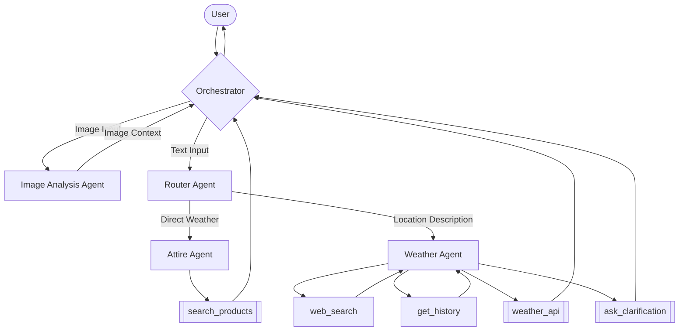

# Weather or Not

## Architecture

```mermaid
graph TD
    user([User]) --> orchestrator{Orchestrator}
    orchestrator -- Image Input --> image[Image Analysis Agent]
    orchestrator -- Text Input --> router[Router Agent]

    router -- Direct Weather --> attire[Attire Agent]
    router -- Location Description --> location[Weather Agent]

    location --> search[web_search]
    location --> history[get_history]
    location --> weather[[weather_api]]
    location --> ask[[ask_clarification]]
    search --> location
    history --> location
    weather --> orchestrator
    ask --> orchestrator

    attire --> products[[search_products]]
    products --> orchestrator

    image -- Image Context --> orchestrator

    orchestrator --> user
```
